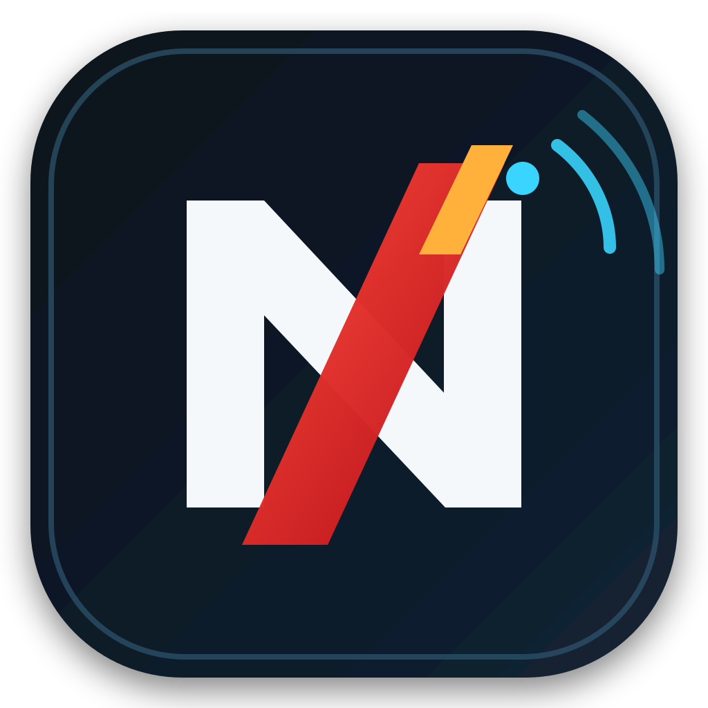
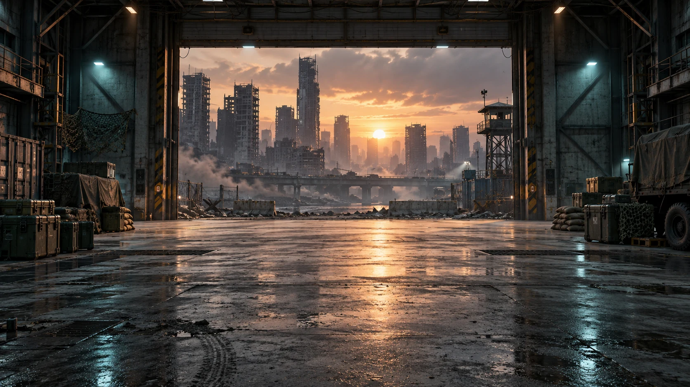

<p align="center">
  
</p>

<h1 align="center">NEXORA: LAST SIGNAL</h1>

<p align="center">
  <strong>The DEADFALL survival experience rebuilt as a complete local/offline Android game.</strong>
</p>

<p align="center">
  <a href="https://github.com/Gh0stDeveloper/NEXORA-LAST-SIGNAL/actions/workflows/ci.yml"></a>
  <a href="https://github.com/Gh0stDeveloper/NEXORA-LAST-SIGNAL/actions/workflows/android-debug.yml"></a>
  <a href="https://github.com/Gh0stDeveloper/NEXORA-LAST-SIGNAL/actions/workflows/release.yml"></a>
  
  
  
  
</p>

<p align="center">
  
</p>

## Overview

**NEXORA: LAST SIGNAL** is the standalone offline edition of the gameplay and presentation direction established in **NEXORA: DEADFALL**. Its authoritative simulation, campaign, zombies, weapons, companions, progression, inventory, saves and HUD all execute on the player's device.

The project has one non-negotiable runtime rule:

> **The complete playable experience must continue working with no Internet connection, no account service, no matchmaking and no backend.**

| Status | Value |
| --- | --- |
| Release candidate | **1.0.0rc** |
| Engine | Godot **4.6.3** |
| Primary platform | Android ARM64 |
| Runtime authority | Local only |
| Internet permission | Disabled |
| Network-state permission | Disabled |
| Game modes | Campaign / Assault / Endless |
| Campaign missions | 4 |
| AI squad | 0–3 companions |
| Difficulty profiles | Story / Normal / Hard / Nightmare |

## Release-candidate experience

### DEADFALL-style startup and match loading

LAST SIGNAL uses two separate loading experiences:

1. **Startup loading** — asynchronously prepares the tactical lobby.
2. **Match loading** — appears every time an operation starts and remains visible while the city, navigation, zombies, loot, HUD, weapons and AI squad are prepared.

The match loader shows the selected **mode, mission, difficulty and squad formation** and guarantees a visible tactical transition before gameplay is enabled.

### Tactical lobby

The lobby retains the DEADFALL presentation structure and has been expanded for offline play:

- 3D operator stage;
- operator identity/profile card;
- local NXC and level display;
- AI party rail;
- quick mode selector always visible;
- full illustrated mode picker;
- campaign mission selector;
- difficulty selector;
- local arsenal/loadout selector;
- settings and local progress;
- SOLO, DÚO IA and ESCUADRA IA formations;
- DEADFALL quarantine-hangar presentation and visual-polish layer.

## Game modes

| Mode | Description | End condition |
| --- | --- | --- |
| **Campaign** | Objective-driven city campaign with local checkpoints | Mission objectives + extraction |
| **Assault · 10 Waves** | Escalating horde survival | Complete 10 waves |
| **Endless** | Unlimited local survival | Player/squad elimination |

Campaign currently contains:

- **Mission 01 — First Signal**
- **Mission 02 — Last Broadcast**
- **Mission 03 — Blackout**
- **Mission 04 — Final Signal**

## Operators and local squad

Current local operator roster:

- **VALERIA** — Recon
- **DANTE** — Vanguard
- **PHOENIX** — Assault
- **SENTINEL** — Support

A run can use **0–3 AI companions**. Companions follow the player, acquire infected, attack through local damage authority, can revive a downed leader and use role-specific support behavior.

## Arsenal

Primary and secondary weapons are selected in the lobby and persisted locally.

| Weapon | Class |
| --- | --- |
| NXR-4 Carbine | Assault rifle |
| NXR-7 Viper | SMG |
| NXR-18 Marksman | DMR |
| NXR-60 Bastion | LMG |
| NXR-9 Sidearm | Pistol |
| NXR-12 Hammer | Heavy pistol |
| Machete | Melee |

Combat includes magazines, reserve ammunition, reloads, weapon switching, ADS, local raycast damage, body-part rules and melee.

## Infected, hordes and bosses

Retained DEADFALL infected archetypes:

- Walker
- Runner
- Crawler
- Tank
- Screamer

Milestone boss encounters include:

- **Titan** — high-health boss with a local shockwave attack.
- **Screamer Prime** — elite Screamer capable of calling additional infected.

## City and atmosphere

The retained city simulation includes:

- deterministic **192×192** campaign layout;
- streets and intersections;
- enterable ruined buildings;
- destroyed/burning vehicles;
- quarantine props;
- navigation mesh generated locally;
- day/night cycle;
- sun, moon, fog and ambient-light transitions;
- bundled DEADFALL ambience and combat audio.

## Inventory, loot and progression

Local systems include:

- ammunition pickups;
- medkits;
- scrap;
- weapon parts;
- inventory/equipment state;
- XP;
- NXC;
- level progression;
- best wave;
- mission completion state;
- campaign checkpoints.

No inventory or progression server exists.

## Mobile HUD

The DEADFALL-derived mobile HUD includes:

- movement joystick;
- touch look;
- fire / ADS / reload;
- jump / sprint / crouch / prone;
- flashlight;
- camera switching;
- weapon slots;
- crosshair;
- health and ammunition;
- quick sensitivity;
- customizable HUD layout with local persistence.

## Offline architecture

```text
Boot
└── Tactical Lobby
    └── Match Loading Overlay
        └── Offline Operation
            ├── LocalAuthority
            ├── CityArena + Navigation
            ├── DayNightCycle
            ├── Local Player
            ├── 0–3 AI Companions
            ├── HordeDirector
            ├── CampaignDirector
            ├── DifficultyDirector
            ├── BossDirector
            ├── LootDirector
            ├── Gore
            ├── MobileHUD
            └── InventoryHUD
```

The runtime deliberately excludes network, server, login, matchmaking and social modules.

The separate **Gh0stDeveloper/Objetos3D** repository is also not required or vendored by LAST SIGNAL.

## Local save files

LAST SIGNAL persists data under Godot's `user://` directory:

```text
last_signal_profile.json
last_signal_settings_v2.json
last_signal_progress.json
campaign_last_signal_campaign.json
```

Campaign persistence uses checksum-protected local saves with backup recovery.

## Android builds

Package:

```text
com.nexora.lastsignal
```

Release candidate:

```text
versionName: 1.0.0rc
versionCode: 10000
```

The numeric Android `versionCode` is an internal monotonically increasing package value. The user-facing version is **1.0.0rc**.

### Debug CI

The Android Debug workflow:

- installs JDK 17 and Android API 36 tooling;
- installs Godot 4.6.3 export templates;
- exports ARM64;
- signs with an ephemeral CI key;
- verifies APK Signature Schemes V1, V2, V3 and V4;
- uploads the APK and V4 `.idsig` as Actions artifacts.

### Public releases

`.github/workflows/release.yml` is configured to publish GitHub Releases with:

- signed APK;
- V4 `.idsig`;
- signature verification report;
- SHA-256 checksums;
- release manifest.

Public release signing requires the persistent repository secrets documented in [docs/RELEASES.md](docs/RELEASES.md). The keystore is never committed.

## Validation

Run locally:

```bash
python tools/verify_offline.py
godot --headless --editor --path . --quit
godot --headless --path . --script scripts/ci/smoke.gd
godot --headless --path . --script scripts/ci/gameplay_smoke.gd
```

CI additionally performs recursive GDScript compilation and rejects network/server/replica APIs if they re-enter the runtime.

## Controls

| Input | Action |
| --- | --- |
| W/A/S/D | Move |
| Shift | Sprint |
| Space | Jump |
| C | Crouch |
| Z | Prone |
| V | Camera |
| F | Flashlight |
| E | Interact |
| Left mouse | Fire |
| Right mouse | ADS |
| R | Reload |
| 1/2/3 | Weapon slots |
| Q | Next weapon |
| I | Inventory |

Android uses the customizable touch HUD.

## Project ownership

Project owner/developer: **Ghost Developer / Nexora**

Presentation/audio credits inherited from DEADFALL are documented in `assets/PRESENTATION_CREDITS.txt`.

---

**NEXORA: LAST SIGNAL — the DEADFALL survival experience, rebuilt to remain playable locally.**
